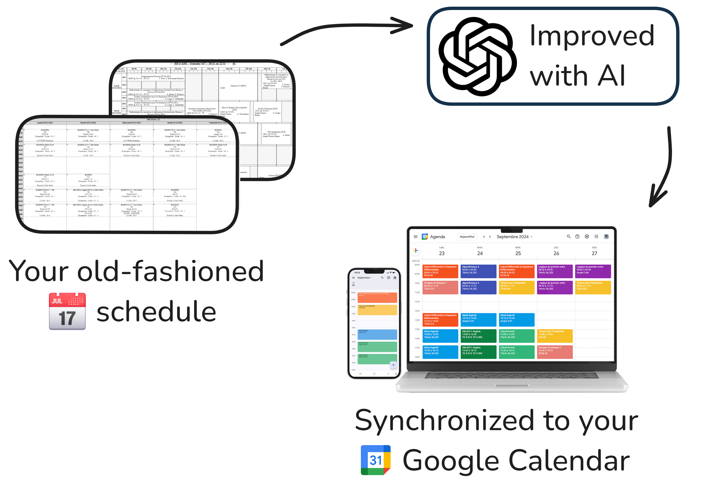

# Syncademic.io

Introducing [Syncademic.io](https://syncademic.io) — the AI-enhanced solution for synchronizing your university schedule with Google Calendar. Enjoy a clutter-free, colorful calendar that updates automatically.

# Key Benefits of Syncademic

1. 📱 **Improved user experience**: Students use the familiar, multi-platform Google Calendar, avoiding old-fashioned university tools.
2. 🌐 **Comprehensive view**: All academic, personal, and professional commitments are visible in one place for better planning and conflict avoidance.
3. 🔄 **Real-time updates**: Stay ahead of changes. Syncademic continuously monitors your schedule, ensuring your calendar is always up to date — and (coming soon) sends you notifications when changes occur.
4. 🖍️ **AI-Powered Customization**: With automatic customizations, event titles are readable, colors are vivid, and irrelevant events are filtered out, making your calendar uniquely yours.

# 🚀 Ready to try Syncademic?
Visit [syncademic.io](https://syncademic.io) and set up your synchronization today — it's free!

Once you're done, you don't need the app anymore ! Just open your Google Calendar and enjoy your beautiful, updated schedule.

# Why Syncademic?

You might wonder: 

> Can’t I just subscribe to an .ics calendar directly in Google Calendar?

Sure, you can — but here’s why Syncademic is better:

1. **Readable Titles, Not Cryptic Codes**  
   - Many academic schedules export events with confusing titles like `IF:5:S1::TCS1:CM::5IF_S1_GR_CM #001`.  
   - Syncademic transforms these into clear, user-friendly titles like `Lecture - Algorithms 2`, making your calendar easier to navigate.

2. **Vibrant Colors for Better Organization**  
   - ICS files typically don’t support event-specific colors, resulting in calendars with a monotonous, single-color look.  
   - Syncademic brings life to your schedule by color-coding events, helping you quickly identify different courses or event types.

3. **Filter Out Irrelevant Events**  
   - Schedules often include optional classes or other events that don’t apply to you.  
   - Furthermore, it's often not possible to edit or delete these events in Google Calendar.
   - With Syncademic, these irrelevant entries are automatically removed, ensuring a cleaner and more personalized calendar.

# How it's made

#### 🧠 **The Backend**
The [backend](./functions/README.md) is powered by [**Firebase Cloud Functions**](https://firebase.google.com/docs/functions), and [**Firebase Firestore**](https://firebase.google.com/docs/firestore).

It handles :
- Authentication using [**Firebase Auth**](https://firebase.google.com/docs/auth).
- Managing Sync Profiles.
- Validating ICS URLs.
- Performing OAuth2 authorization with the Google Calendar API to allow Syncademic to update your calendar.
- Creating customization rules with the help of AI for each Sync Profile to improve the calendar.
- Synchronizing the schedules with Google Calendar for each user.

#### 📱 **The Frontend**
Our [frontend](./syncademic_app/README.md) is made using Flutter, a cross-platform framework that allows us to build apps for iOS, Android, and the web from a single codebase.

It is compiled as a **web app** and hosted using [**Firebase Hosting**](https://firebase.google.com/docs/hosting) at [app.syncademic.io](https://app.syncademic.io).

#### 🤖 **AI at Work**
Syncademic uses `gpt-4o` and [Langchain](https://langchain.com/) to analyze schedules and create customization rules to improve user experience.

To provide the AI with the schedule data, we use a clustering approach based on TF-IDF Features and HDBSCAN to group similar events together. This helps "compress" the schedule and make it easier for the AI to understand.

The LLM first generates what it understands about the schedule : the event types, the language, the abbreviations, most important classes, etc. Then, it writes down a set of eventual problems that it sees in the schedule, and how it could solve them. 

Finally, it generates the full set of customization rules as a JSON object. It describes what to do with each event and when : change the color, the title, the description, or even remove the event, and under which conditions.

[Langsmith](https://www.langchain.com/langsmith) is used to trace the AI's reasoning and to help debug and improve the AI's understanding of the schedule.

Read more about AI in Syncademic [here](./dev/docs/ai.md).

#### 📚 **Core Concepts**
Syncademic relies on concepts like **Sync Profiles**, **Customization Rules**, and **Event Clustering** to work its magic. See [Concepts](./dev/docs/concepts.md) for more information.

# 📚 Future Features

- **Broader Calendar Support:** Expand compatibility to include other calendar apps like Microsoft Outlook and Apple Calendar.
- **ICS-to-ICS Customization:** Allow users to customize their ICS files directly, providing a solution for users of calendars like Proton Calendar that don't rely on APIs.
- **Event Change Notifications:** Notify users of changes in their academic schedules, such as updates to events or cancellations.
- **General Notifications:** Provide reminders for synchronization status, errors, or important updates.
- **Advanced AI Integration:** Leverage LangGraph and smaller, specialized LLMs to enhance customization, improve efficiency, and enable more dynamic workflows.
