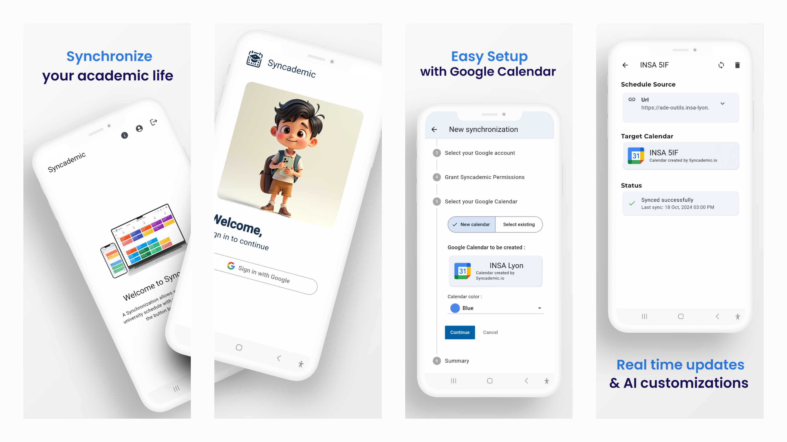

# syncademic_app

The user interface for Syncademic developed using Flutter.



**Goals**

- Authenticate users via Firebase Authentication with Google Sign-In.
- Allow users to input the URL of their time schedule.
- Enable users to select their Target Calendar for event synchronization.
- Authorize the backend to modify the user's calendar autonomously.

**Hosting**

- The Flutter application is compiled as a web app and hosted on Firebase Hosting.

**Mobile apps**

- The frontend is designed to be used infrequently. After the initial setup, the synchronization process should run automatically without needing any user input. Because of this, a hosted website would be sufficient for our requirements. However, we are also focusing on Android platforms. This is because developing on Android is simpler than web development, as Flutter's hot reload feature is available on Android but not on the web.

## Getting Started

### Firebase

Firebase is used for this project.

Go to [this guide](https://firebase.google.com/docs/flutter/setup) to :

- Install the firebase CLI
- Install the fluterfire CLI
- Run `flutterfire configure`

### Release signing

Add the release keystore file at [./android/app/release.keystore](./android/app/release.keystore)

Create a file named [project]/android/key.properties that contains a reference to your keystore.

```properties
storePassword=<password>
keyPassword=<password>
keyAlias=syncademic_release_sha1_key
storeFile=release.keystore
```

For more information check https://docs.flutter.dev/deployment/android


# Future Features

**Translation** : The app is currently available in English. A translation library should be implemented to support additional languages, and appropriate translations provided.

**Time Schedule Visualization** : The app should display the user's time schedule before and after customization during setup. This will help users understand how the customization rules will affect their calendar. 

**Notifications** : The app should notify users when a synchronization failed to allow reconfiguration. Users could also be notified when an event is modified or deleted.

